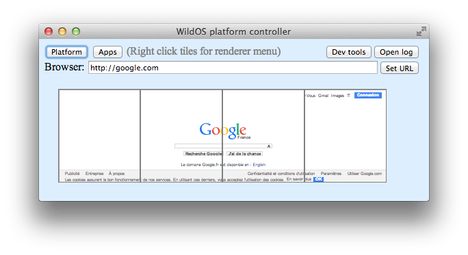
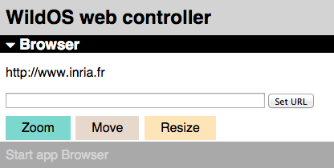
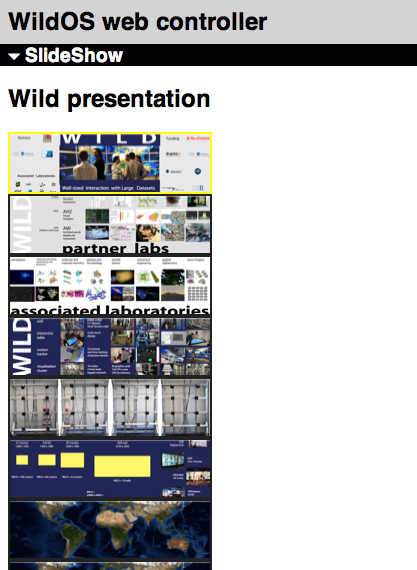

WildOS - Read Me
========

General presentation
--------

WildOS is middleware to support applications running in an interactive room featuring various interaction resources, such as our [WILD room](http://www.lri.fr/~mbl/WILD): a tiled wall display, a motion tracking system, tablets and smartphones, etc.

The conceptual model of WildOS is that a *platform*, such as the WILD room, is described as a set of *devices* and can run one or more *applications*.

WildOS consists of a server running on a machine that has network access to all the machines involved in the platform, and a set of clients running on the various interaction resources, such as a display cluster or a tablet. Once WildOS is running, applications can be started and stopped and devices can be added to / removed from the platform.

WildOS relies on Web technologies, most notably [Javascript](http://en.wikipedia.org/wiki/JavaScript) and [node.js](http://nodejs.org), as well as [node-webkit](https://github.com/rogerwang/node-webkit) and [HTML5](http://en.wikipedia.org/wiki/HTML5). This makes it inherently portable (it is currently tested on Mac OS X and Linux). While applications can be developed only with these Web technologies, it is also possible to bridge to existing applications developed in other environments if they provide sufficient access to be remote controlled.

WildOS is still in a very preliminary stage, so expect bugs, crashes and weird behaviors!

Installing WildOS
--------

### Before installing WildOS ###
First you need to have [node.js](http://nodejs.org) and [node-webkit](https://github.com/rogerwang/node-webkit) installed both on the machine where you will be running the WildOS server and on the machines where you will be running clients, such as the display cluster. (You do not need to install anything on those machines where the WildOS clients will run in a regular browser, such as tablets and smartphones). 

#### Installing node.js and npm ####

If `node.js` is already installed on your machine, make sure that it is a recent version (at least 0.10.28) by typing

	% node --version

If node.js is not installed or the version is too old, follow the instructions on the [node.js](http://nodejs.org) web site.

`npm`, the node package manager, is installed together with node.js and is used by the WildOS installer.

#### Installing node-webkit ####

To install `node-webkit`, go to the [node-webkit](https://github.com/rogerwang/node-webkit) web site and download the version for your OS. Do **not** install node-webkit with the npm package 'nodewebkit' as this does not work well. 

WildOS requires version 0.9.2 or later of node-webkit.

On Mac OS X, node-webkit is an application and should be copied to the standard `Applications` folder.

On Linux, node-webkit is an executable called `nw` and should be accessible in the `PATH`.
The simplest way to install is to copy `nw` to `/usr/local/bin` or to create a symbolic link.
To install in `/opt` and support mulitple versions, follow the instructions in [this web page](http://www.exponential.io/blog/install-node-webkit-on-ubuntu-linux).

### Installing the WildOS server ###
After you have checked out WildOS from the [SVN repository](https://www.lri.fr/svn/in-situ/code/WILD/WildOS) or extracted it from the archive, you need to finalize the installation as follows:

	% cd WildOS/server
	% npm install  

This will create a `node_modules` directory in the `WildOS/server` directory and install the node modules needed by WildOS there. (Make sure you are in the `server` directory).

### Configuring the installation ###
This step is optional, but strongly recommended unless you have an alternative way of easily running commands on all the machines in your display cluster.

The script `walldo` (in directory `tools`) is a utility that runs commands on a set of client machines. Type `tools/walldo -h` to see a description.

Before using `walldo`, you need to configure it for your local setup. The recommended way to do this is to create a hidden directory `~/.walldo` and to create a configuration file in this directory. The configuration should contain at least the following lines:

	allHosts=(the list of client hostnames, separated by spaces and between parentheses)
	anyHost=a glob expression that matches all the host names
	DOMAIN=the domain name to add to each hostname
	SU=the user name to sudo to when using the sudo command

For our WILD wall, which has 16 machines called `a1 ... d4`, the configuration looks like this:

	allHosts=(a1 a2 a3 a4 b1 b2 b3 b4 c1 c2 c3 c4 d1 d2 d3 d4)
	anyHost=[a-d][1-4]
	DOMAIN=.wild.lri.fr
	SU=wild

Once the configuration file is created, the `WALL` environment variable must be set to its name for `walldo` to use it. If your config file is `~/.walldo/MyWall`, then you should set:

	% WALL=MyWall export WALL

An alternative to creating the configuration file is to edit the `walldo` script directly, but this is not recommended as the changes will be lost when you install a future version. If you insist on doing this, the changes are to be done at the beginning of the file (follow the comments).

A simple change you may want to do to the script even if you have created the configuration file is to change the default value when `$WALL` is not defined, at the very beginning of the script (the default value is `WILD`).

### Creating a platform configuration file ###

The `WildOS/configs` directory contains JSON files describing the set of devices making up a platform running WildOS.
The `$WALL` environment variable is used to fetch the corresponding configuration file under the name `WildOS/configs/$WALL.json`.

The best way to create a configuration file is to copy an existing one and edit it.
This section walks through the `WILD.json` file to describe its content. Another useful file to look at is `local.json`.

The configuration file is a hierarchy of objects, each describing a part of the platform.
Each object has a mandatory property: `type`. The root object must be of type `platform`.

The `WILD.json` configuration file defines a platform called `WILD room`:

- The `UI` property defines the position and size of the window created by the server to control the platform (`frame` property) and the zoom factor to apply to the miniature display of the wall in the control window;
- The `wall` property defines the tiled display (see below);
- The `controllers` property enables the use of web-based devices (tablets and smartphones, typically).

The `wall` property defines the geometry of the tiled display:

- The `tileSize` property defines the number of pixels of each tile (all tiles are assumed to be of the same size);
- The `bezelSize` property defines the number of pixels "hidden" behind the bezels. If you specify 0, the bezels will be ignored;
- The `numTiles` property defines the number of rows and columns of the tiled display (we assume a rectangular layout);
- The `tiles` property defines which machine runs which tile (see below);
- The `renderer` property can be set to `perTile` or `perHost`. The former means that one rendering client is launched for each tile, while the latter means that one rendering client is launched for each host (if the host runs multiple tiles, the client will create one window per tile). Currently, we use mostly `perTile` 
- The `restart` property is the shell command for restarting all the clients.

The `tiles` property of the wall is a two-dimensional array (an array of lines, each line being an array of tiles). Each element of this two-dimensional array represents a tile and is itself an array with two elements:

- the name of the host running that tile,
- the name of the tile within that host, e.g. `L` or `R` if a host runs two side-by-side tiles.

Note that the `local.json` configuration file includes a property `layout` in the description of its tile display.
This property is used to map the names of the tiles to the position of their corresponding window on the screen.
When this property is not present, which is the normal case, each tile is run full-screen.

### Installing the clients ###
At present, WildOS features a rendering client for tiled displays and a web client for tablets and smartphones. Only the former (the rendering client) needs to be installed on the machine(s) running your tiled display. (See below what to do to run a test version locally on your machine).

Assuming that the configuration of your display cluster is properly described in the `configs` directory (see previous section), all you need to do to install the clients for the platform `MyWall` is:

	% WALL=MyWall export WALL  
	% make install  

Also, if you need to log in as a different user on the remote machines, make sure to either set the `LOGNAME` environment variable to that user or to edit the Makefile and change the `walldo` command on the second line (see the example in the commented-out first line). 

#### Installing the clients by hand ####
Alternatively, you can install the clients by hand by following these steps:

* Create the `WildOS` directory on the destination machines (preferably under the home directory of the target user);
* Recursively copy the `renderer`, `shared` and, optionally, `slides` directories to the destination machines under `WildOS`;
* Install the node.js packages by running `npm install` in the `WildOS/renderer` directory in each destination machine.

### Testing with local clients ###
If you do not have access to a tiled display, you can test locally on your machine by setting the `WALL` environment variable to `local`:

	% WALL=local export WALL  

In this case, there is no need to install the client as described above: it is already in the `renderer` directory.

### Extras ###
If you want to re-generate the documentation (which you don't need to do unless you plan to edit it), you will also need to install [MultiMarkdown](http://fletcherpenney.net/multimarkdown/), a tool to compile Markdown files into HTML.

Then simply run

	% make docs

to generate `ReadMe.html` as well as the content of the `doc` directory.

### Updating an existing install ###
If you update WildOS, e.g. with `svn update`, you need to update the clients with `make update`.

If the update does not seem to work, try to remove the `node_modules` directories on each client machine and re-install :

	% walldo -d WildOS/renderer rm -rf node_modules
	% walldo -d WildOS/renderer npm install

Running WildOS
--------

Once everything is installed properly, you should be able to run WildOS.
WildOS consists of multiple processes: a server and a set of clients. The order in which they are run (and stopped and restarted) should not matter. For example, you can stop the server, restart it, and the clients will automatically reconnect to it. However, if things go really wrong, it's better to kill everything, start the server, and then the clients.

### Running the server ###
You run the WildOS server on the main computer. The server is a node-webkit application, however it is not packaged as a standalone application so you need to run it from the command line. Node-webkit is slightly different on Mac OS X and Linux so the command to run it is a bit different:

* On Mac OS X, we assume that node-webkit is in `/Applications`. If not, edit the `tools/nw` so that `NWAPP` points to it.
* On Linux, node-webkit is expected to be in the PATH (typically in `/usr/local/bin`).

Also, remember that the name of the platform must be set in the `WALL` environment variable.
In order to test on a single machine, you can set `WALL` to `local` and run the server and clients on the same machine.

To run the server on Mac OS X:

	% cd WildOS/server  
	% ../tools/nw   

To run the server on Linux:

	% cd WildOS/server  
	% nw .  

This should open a window with lots of traces, and another window depicting the wall display with the buttons `Restart` and `Shutdown` at the top. 
The `Applications` menu lists the available applications. In order to quickly test if the server works, even without any clients running, you can select the `Browser` application. A text entry field should appear in the main window and if you enter a URL, it will show up in the miniature wall, as shown on the screen dump below. Note that the tiles are pink and semi-transparent to show that there is no client running.

You can start the server with an initial set of running applications simply by adding them to the command line:

	(macos)% ../tools/nw Browser  
	(linux)% nw . Browser  

### Running the rendering clients ###
To run the rendering clients, simply click the `Restart` button in the main window. or select `Restart` in the `Platform` menu.
Alternatively, you can run the following command in a terminal window unless you are running the clients locally:

	% walldo WildOS/renderer/restart  

If you are running clients locally, the command instead is (assuming you are in the WildOS directory):

	% renderer/restart  

This will kill any existing clients and then start them again. Each client machine should first show a window with lots of traces and then, as soon as it has managed to connect to the server, it should display a full-screen blank window with the same web page as the one you loaded on the server. (If you are running clients locally, it will create four small windows mimicking a small tiled display instead of running full screen).

Note that on the server, the controller window will have its tiles turn fully transparent as the clients connect to the server. This tells you whether the server has successfully communicated with the clients:

### Running the web clients ###
The server application displays in the top-right corner a QRcode of the URL for web clients to connect to the server. Simply flash this code or enter the URL in your browser (smartphone, tablet or any computer with a recent Web browser). The URL is:

	http://<server-hostname>:8080/controller.html  

This should open a page empty at first (except for the title "WILD controller"), then, assuming the Browser application is still running, it should display a text entry field to change the URL displayed in the browser of the tiled display:

### Shutting down ###
Click the `Shutdown` button or select the `Shutdown` command in the `Platform` menu to stop the rendering clients. Note that this will only work if they are still responding. If they are not, you will have to kill them "by hand" with the following command:

	% tools/walldo killall nw

(If you are running local clients, you can kill them in the usual way, e.g. by selecting their `Quit` command).

To quit the server, select the `Quit` command in its menu or use the usual quit keyboard shortcut (command-Q on Mac OS X).
Note that this does **not*** kill the clients (mostly so that you can test if they reconnect correctly when restarting the server).

Note that the `Start` and `Stop` commands in the `Platform` menu are currently inactive.

The applications
--------

### The Browser application ###
The Browser application has been introduced above. It has one more feature that we haven't described: you can pan the page by dragging the miniature image of the page in the controller window on the server, and you can zoom it in/out by using the scrollwheel of your mouse when the cursor is on the miniature image. This makes it easy to scale the web page to the size of your wall display.

### The SlideShow application ###
The SlideShow application is designed to show a series of precomputed large images on the wall display. The images and the files describing the slideshows must be in the `slides` directory, and the `tilecutter` Mac OS X console application must be used to cut the images into tiles that can be used by the SlideShow application.

Separate documentation (to be written!) will explain how to do this. At present, if you have access to the WILD room, the best thing to do is to use the version of WildOS installed on `frontal-1`: once logged in, open a terminal window and issue the following commands:

	% cd Desktop/mbl/WildOS/renderer  
	% LOGNAME=mbl export LOGNAME  
	% tools/nw SlideShow

On the server, you can load a new slideshow by clicking the `Load SlideShow` button and selecting a file, or by dragging a slideshow file onto the miniature wall. You can also view an arbitrary collection of the large images in the `Desktop/Slides` folder by dragging the image files and/or folders onto the miniature wall.

On both the server interface and the web controller, you can use the `First`, `Prev`, `Next` and `Last` buttons to navigate the slideshow. On the web controller, you can also go to the next slide by tapping the thumbnail of the slide.

### The Cursors application ###
The Cursors application lets users create and move several cursors on the wall display. At present, it does not do anything else, e.g. you cannot "click" with those cursors.

The controller interface on both the server and on the web clients lets you create new cursors, select them by clicking their swatch, and delete the selected cursor. On the server, you can move a cursor either by dragging it directly in the miniature image of the wall, or by using the swatch as a joystick. On the web client, when you select a cursor swatch, the large area below turns the same color and you can drag the mouse (or finger on a touch screen) in it to move the cursor with a joystick-like interaction.

Developping for WildOS
--------

WildOS is in active development. We need users to give us feedback, contribute code, and create their own applications.

The `doc` directory contains [documentation](doc/index.html) describing the general architecture of the system and how to create new devices and new applications.
The source code is also fairly commented.

So read the documentation, read the code and hack away!

Credits
--------

WildOS is developed by [Michel Beaudouin-Lafon](http://www.lri.fr/~mbl) and inspired by lots of previous work, most notably the [Substance](https://www.lri.fr/perso/~mbl/WILD/publications/index.html#substance-chi11) framework.
